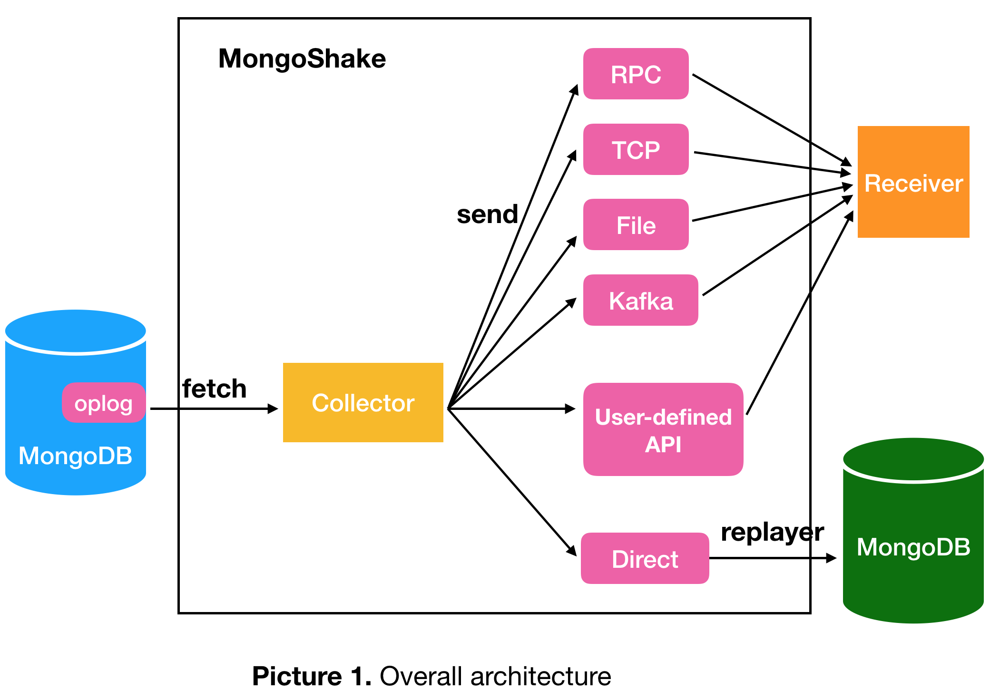

This is a brief introduction of Mongo-Shake, please visit [english wiki](https://github.com/aliyun/mongo-shake/wiki/MongoShake-Detailed-Documentation) or [chinese wiki](https://yq.aliyun.com/articles/603329) if you want to see more details including architecture, data flow, performance test, business showcase and so on.

# Mongo-Shake
---
Mongo-Shake is developed and maintained by DocumentDB Develop Team in Alibaba-Cloud. 
Mongo-Shake is a universal platform for services based on MongoDB's oplog. It fetches oplog from source mongo database, and replays in the target mongo database or sends to other ends in different tunnels. If the target side is mongo database which means replay oplog directly, it's like a syncing tool that used to copy data from source MongoDB to another MongoDB to build redundant replication or active-active replication. Except for this direct way, there are others tunnel types such like rpc, file, tcp, kafka. Receivers wrote by users must define their own interfaces to connecting to these tunnels respectively. Users can also define there own tunnel type which is pluggable. If connecting to a third-party message middleware like kafka, the consumer can get the subscriber data in an asynchronous way in pub/sub module flexibly.
Here comes general data flow,  
 
The source can be either single mongod, replica set or sharding while target can be mongod or mongos. If the source is replica set, we suggest fetching data from secondary/hidden to ease the primary pressure. If the source is sharding, every shard should connect to Mongo-Shake. There can be several mongos on the target side to keep high availability, and different data will be hashed and written to different mongos.

# Parallel Replication
---
There are three options for parallel replication which we call 'shad\_key': __id__, __collection__ and __auto__. __id__ means the concurrency granularity is document while __collection__ means the granularity is collection/table. __auto__ option is decided by if there has unique index of any collection, it will change to __collection__ with unique index exist otherwise __id__.

# High Availability
---
Mongo-Shake periodically persistent its context into register center which by default is the source database. Currently, the context is checkpoint which marks the position of successfully replay oplog. 
Hypervisor mechanism is also supported so that it will restart immediately when dies.

# Filter
---
Support filtering database and collection namespace with whitelist and blacklist.

# Global ID
---
In Aliyun internal version, global id(also called gid) is supported which marks the id of the database. It can be used to avoid loop when two databases become backup of each other. Mongo-Shake only fetches the oplogs equal to source database id, all the oplogs are be fetched when no gid gave. For current opensource version, it's not supported limited by the modification of MongoDB kernel.

# Tunnel
---
As mentioned above, we support several tunnel types such like: rcp, tcp, file, kafka, mock and direct. __rpc__ and __tcp__ means connecting to receiver synchronously by net/rcp and TCP respectively; __file__ means writing output into file; __kafka__ is an asynchronous way of sending the message; __mock__ is used by testing that throws away all the data; __direct__ means writing into target MongoDB directly. Users can also add or modify current tunnel type.

# Compressor
---
Gzip, zlib, deflate compressor are supported in batched oplogs before sending.

# Other Details
---
Mongo-Shake uses [mgo.v2 library](https://github.com/vinllen/mgo) which is a modification version of [mgo.v2](https://github.com/go-mgo/mgo/tree/v2) to fetch oplogs from source MongoDB which is later than the given timestamp in configuration. Then, it filters oplogs based on whitelist, blacklist, and gid. All the oplogs will be transferred at least once which is acceptable because of idempotent of oplog DML. We use __seq__ and __ack__ to make sure the package is received which is similar to the sequence and acknowledgment numbers in TCP. 
The oplogs are batched together in the handling pipeline. 
Users can adjust the worker concurrency and executor concurrency according to the different environment. 
Please see the detail documents listed at the beginning if you want to see more details. 

# Usage
---
*  git clone https://github.com/aliyun/mongo-shake.git
*  cd mongo-shake/src/vendor
*  GOPATH=\`pwd\`/../..; govendor sync     #please note: must install govendor first and then pull all dependencies
*  cd ../../ && ./build.sh
*  ./bin/collector -conf=conf/collector.conf #please note: user must modify collector.conf first to match needs. You can also use start.sh script which supports hypervisor mechanism in Linux OS.
